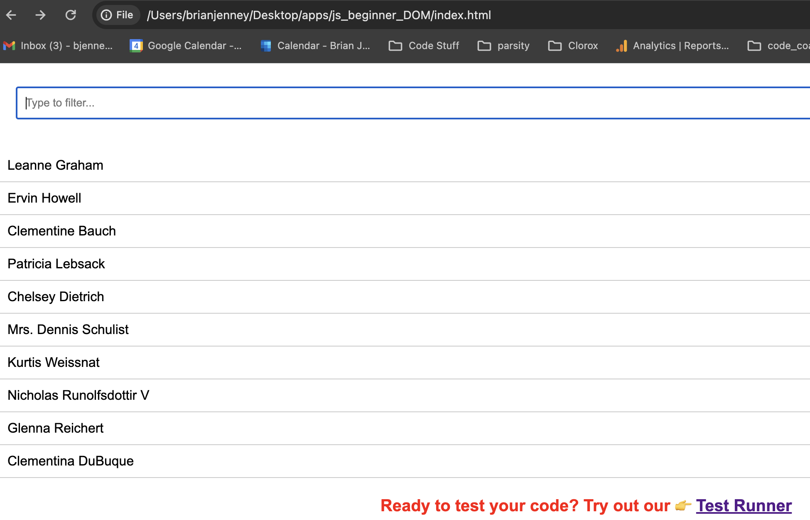
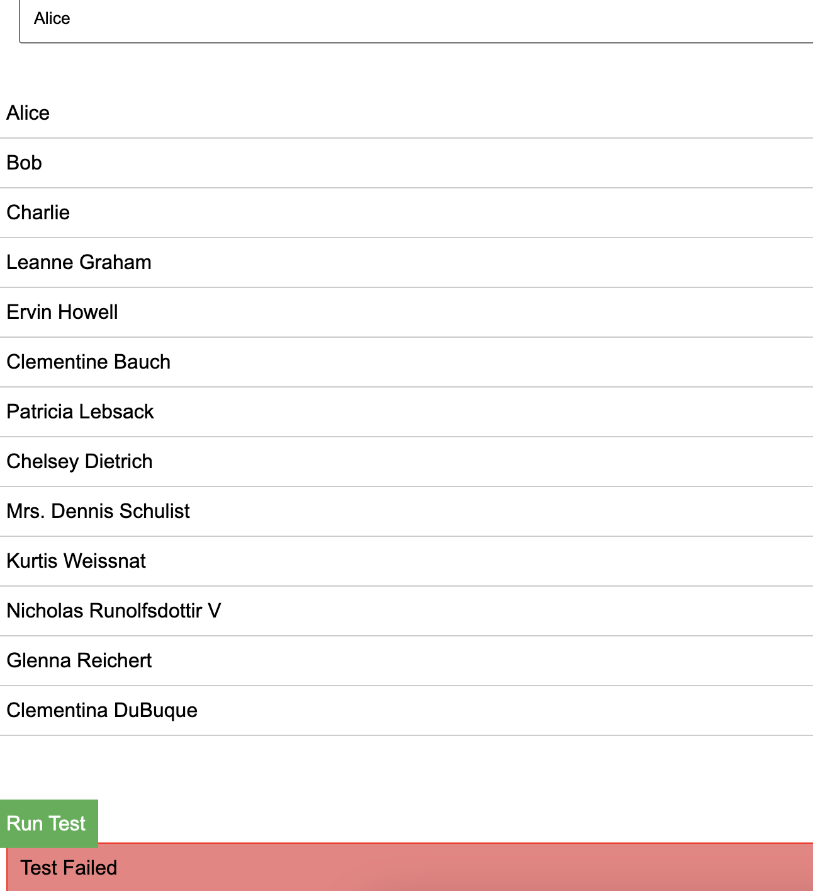

# Broken Filter Needs Fixing

### Setup

1. Open up this program in your browser by opening the `index.html` file
2. Type a name in the input and you should see the list of users filtered by the name you entered.

One problem...

It doesn't work yet!

### Your Task

Add functionality in `script.js` for the `filterData` function to work as expected.

To see if it truly works, head to `/test.html` and press the `Run Test` button, to you know... run the tests. If it passes, you're all good. If not... well, keep at it.

If you're a Parsity student, feel free to ask questions in Slack. If you're not a Parsity student, you can email me at brian@parsity.io for a hint or to submit your work.

Good luck!
